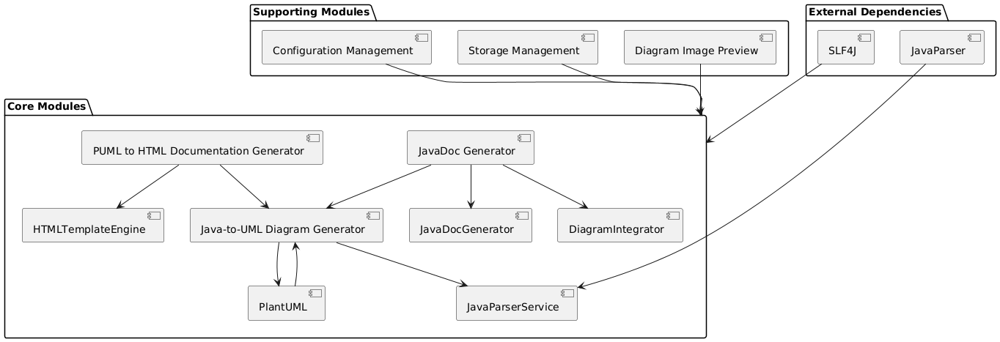

# Technical Specification: J2Arch

## 1. Introduction

### 1.1 Purpose
This document provides a detailed technical specification for the J2Arch project. It describes the system architecture, components, and implementation details for each module, serving as a guide for developers and architects.

### 1.2 Scope
J2Arch is a tool designed to analyze Java source code and generate UML diagrams, HTML documentation, and JavaDoc. It supports both default and user-defined configurations, hybrid storage options, and integration with CI/CD pipelines.

### 1.3 Audience
This document is intended for developers, architects, and QA engineers involved in the development, maintenance, and testing of J2Arch.

---

## 2. System Architecture

### 2.1 Overview
J2Arch follows a modular architecture to ensure scalability, maintainability, and extensibility. Each module is responsible for a specific functionality, such as diagram generation, documentation generation, or configuration management.

### 2.2 Architectural Diagram

### 2.3 Key Design Patterns
- **Strategy Pattern**: Used for storage management (in-memory, persistent, cloud).
- **Factory Pattern**: Used for creating context objects (e.g., UMLGenerationContext, HTMLGenerationContext).
- **Singleton Pattern**: Used for configuration management to ensure a single source of truth.

---

## 3. Modules and Components

### 3.1 Java-to-UML Diagram Generator

#### Purpose
This module parses Java source code and generates UML diagrams to visualize class structures, relationships, and method interactions.

#### Components
- **JavaParserService**:
  - Parses Java source files to extract metadata (classes, methods, fields, relationships).
  - Uses the JavaParser library for parsing.
- **UMLDiagramGenerator**:
  - Converts extracted metadata into UML diagrams.
  - Supports class diagrams and sequence diagrams.
- **PlantUML Integration**:
  - Uses PlantUML to generate diagrams in PNG, SVG, and `.puml` formats.
- **ProjectAnalyzer**:
  - Collects Java source files and avoids redundant file collection for class and sequence diagrams.

#### Workflow
1. Collect Java source files using `ProjectAnalyzer`.
2. Parse files and extract metadata using `JavaParserService`.
3. Generate UML diagrams (class and sequence diagrams) using `UMLDiagramGenerator` and PlantUML.

#### Output
- Class diagrams and sequence diagrams in PNG, SVG, and `.puml` formats.
- Sequence diagrams accurately handle overloaded methods by differentiating based on parameter types.

---

### 3.2 PUML to HTML Documentation Generator

#### Purpose
This module converts PlantUML files into HTML documentation for easy sharing and navigation.

#### Components
- **PUMLParser**:
  - Parses `.puml` files to extract diagram information.
- **HtmlGenerator**:
  - Generates HTML pages using predefined or user-defined templates.
  - Handles CSS file copying and template loading.
- **StylesheetManager**:
  - Manages CSS styles for consistent formatting.

#### Workflow
1. Parse `.puml` files using `PUMLParser`.
2. Generate HTML pages using `HtmlGenerator`.
3. Apply styles using `StylesheetManager`.
4. Track progress using `ProgressTracker` during file processing and HTML generation.

#### Output
- HTML documentation with embedded UML diagrams.

---

### 3.3 JavaDoc Generator

#### Purpose
This module generates JavaDoc documentation for Java source code, integrating UML diagrams for enhanced visualization.

#### Components
- **JavaDocGenerator**:
  - Invokes the `javadoc` tool programmatically.
  - Generates JavaDoc for classes, methods, and fields.
- **DiagramIntegrator**:
  - Embeds UML diagrams into the generated JavaDoc HTML files.
- **TemplateManager**:
  - Manages custom templates for JavaDoc generation.

#### Workflow
1. Generate JavaDoc using `JavaDocGenerator`.
2. Embed UML diagrams using `DiagramIntegrator`.
3. Apply custom templates using `TemplateManager`.

#### Output
- JavaDoc HTML files with embedded UML diagrams.

---

### 3.4 Diagram Image Preview

#### Purpose
This module provides an interactive interface for previewing and managing generated UML diagrams and HTML documentation.

#### Components
- **DiagramViewer**:
  - Displays UML diagrams (class diagrams, sequence diagrams).
- **HTMLViewer**:
  - Displays HTML documentation with embedded diagrams.
- **UIManager**:
  - Manages the graphical user interface (JavaFX).

#### Workflow
1. Load diagrams and HTML files.
2. Display content using `DiagramViewer` and `HTMLViewer`.
3. Provide navigation and export options.

---

### 3.5 Configuration Management

#### Purpose
This module manages default and user-defined configurations for the application.

#### Components
- **ConfigurationLoader**:
  - Loads configurations from `application.properties` or user-defined files.
- **ConfigurationValidator**:
  - Validates configuration values (e.g., paths, formats).
- **ConfigurationManager**:
  - Provides a centralized interface for accessing configuration values.

#### Workflow
1. Load configurations using `ConfigurationLoader`.
2. Validate configurations using `ConfigurationValidator`.
3. Provide access to configurations via `ConfigurationManager`.

---

### 3.6 Storage Management

#### Purpose
This module handles data storage, supporting in-memory, persistent, and cloud storage options.

#### Components
- **InMemoryStorage**:
  - Stores data in memory for fast access.
- **PersistentStorage**:
  - Uses SQLite/PostgreSQL for structured storage.
- **CloudStorage**:
  - Integrates with AWS S3 or similar services for cloud storage.

#### Workflow
1. Determine storage mode based on configuration.
2. Store and retrieve data using the appropriate storage component.

---

## 4. Technology Stack

### 4.1 Programming Language
- Java (version 11 or higher).

### 4.2 Libraries and Frameworks
- **JavaParser**: For parsing Java source code.
- **PlantUML**: For generating UML diagrams.
- **SLF4J**: For logging.
- **JavaFX**: For the graphical user interface.

### 4.3 Build Tools
- Maven or Gradle.

### 4.4 Database
- SQLite/PostgreSQL for persistent storage.

### 4.5 Cloud Integration
- AWS S3 or similar for cloud storage.

---

## 5. Data Flow

### 5.1 Input and Output
- **Input**: Java source files, `.puml` files, configuration files.
- **Output**: UML diagrams, HTML documentation, JavaDoc.

---

## 6. Configuration Details

### 6.1 Default Configuration
- Input Directory: `./input`
- Output Directories:
  - UML Diagrams: `./umldoc`
  - PUML Files: `./umldoc/puml`
  - HTML Documentation: `./htmldoc`
  - JavaDoc: `./javadoc`

### 6.2 User-Defined Configuration
- Users can override default configurations using the `application.properties` file.

---

## 7. Error Handling and Logging

### 7.1 Error Handling
- Validate input directories and files.
- Handle missing or invalid configurations gracefully.

### 7.2 Logging
- Use SLF4J for logging.
- Log levels:
  - INFO: General information.
  - DEBUG: Detailed debugging information.
  - ERROR: Errors and exceptions.

---

## 8. Security Considerations

### 8.1 Input Validation
- Validate input directories and files to prevent malicious input.

### 8.2 Secure Storage
- Encrypt sensitive data if applicable.

### 8.3 Cloud Security
- Use secure credentials and bucket policies for cloud storage.

---

## 9. Performance Considerations

### 9.1 Scalability
- Optimize parsing and diagram generation for large projects.

### 9.2 Optimization
- Use caching for frequently accessed data.

---

## 10. Testing and Validation

### 10.1 Unit Testing
- Test individual components (e.g., `JavaParserService`, `UMLDiagramGenerator`).

### 10.2 Integration Testing
- Test interactions between modules.

### 10.3 Performance Testing
- Test scalability and performance under load.

---

## 11. Future Enhancements
- Support for additional UML diagram types (e.g., activity diagrams, state diagrams).
- Integration with more cloud providers (e.g., Google Drive, Azure).
- Real-time collaboration features for distributed teams.

---

## 12. Appendix

### 12.1 Glossary
- **UML**: Unified Modeling Language.
- **PUML**: PlantUML file format.
- **JavaDoc**: Documentation generated for Java source code.

### 12.2 References
- JavaParser Documentation.
- PlantUML Documentation.
- SLF4J Documentation.